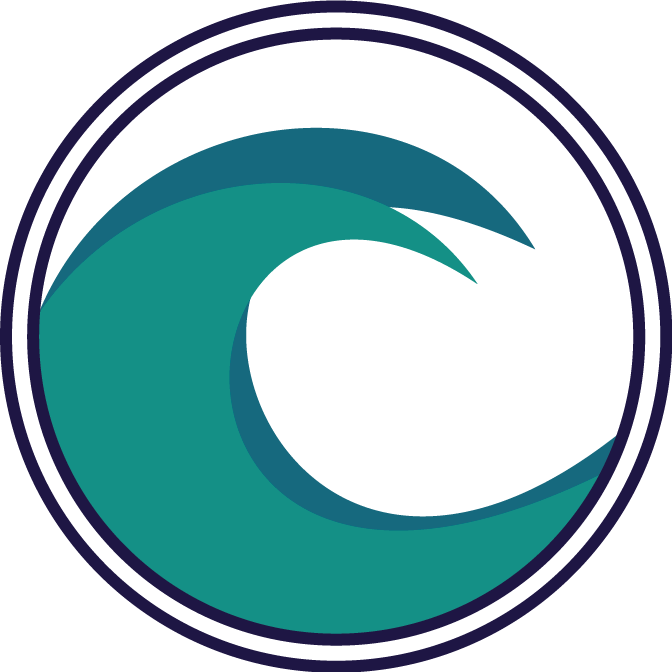

# Student-led Conferences

Student-led conferences present the opportunity for students to lead conferences informing their parents and guardians about their academic progress. Through the program students are able to take control of their learning experience which is a key component to creating an environment in which students can thrive to achieve their best at Surf Coast Secondary College.

Parents and guardians have expressed interest in a redesign of the student-led conference forms and have outlined various design choices that, while meeting the requirements of a booking form, have created an unintuitive and complicated experience.

### Terms
A list of words and phrases used throughout the document to describe specific things in context to the software:
<dl class="def">
    <dt><dfn id="School">School</dfn></dt><dd>Surf Coast Secondary College, the school the form is being built for.</dd>
    <dt><dfn id="Original_Form">Original Form</dfn></dt><dd>the original student-led conference form that was created for the <a href="#School"><i>School</i></a>.</dd>
    <dt><dfn id="Form">Form</dfn></dt><dd>the new student-led conference form, a redesign that is being created for the <a href="#School"><i>School</i></a>.</dd>
    <dt><dfn id="Student">Student</dfn></dt><dd>the students at the <a href="#School"><i>School</i></a>.</dd>
    <dt><dfn id="Guardian">Guardian</dfn></dt><dd>the guardian(s) of the <a href="#Student"><i>Students</i></a>.</dd>
    <dt><dfn id="Family">Family</dfn></dt><dd>one or more <dfn>Student(s)</dfn> associated with a <a href="#Guardian"><i>Guardian</i></a>.</dd>
    <dt><dfn is="Family_Login">Family Login</dfn></dt><dd>account details providing a <a href="#Family"><i>Family</i></a> access to the <a href="#Form"><i>Form</i></a>.</dd>
    <dt><dfn id="Teacher">Teacher</dfn></dt><dd>the teachers at the <a href="#School"><i>School</i></a>.</dd>
    <dt><dfn id="Teacher_Login">Teacher Login</dfn></dt><dd>account details providing a <a href="#Teacher"><i>Teacher</i></a> access to the <a href="#Form"><i>Form</i></a>.</dd>
    <dt><dfn id="Association_Database">Association Database</dfn></dt><dd>a database of the <a href="#Family"><i>Family</i></a>, <a href="#Guardian"><i>Guardians</i></a>, <a href="#Student"><i>Students</i></a> and <a href="#Teacher"><i>Teachers</i></a> containing associations between.</dd>
    <dt><dfn id="System">System</dfn></dt><dd>the system; this incorporates the all the components of the <a href="#Form"><i>Form</i></a> including the <a href="#Association_Database"><i>Association Database</i></a>.</dd>
    <dt><dfn id="System_Administrator">System Administrator</dfn></dt><dd>an administrator of the <a href="#System"><i>System</i></a>.</dd>
    <dt><dfn id="System_Administrator_Login">System Administrator Login</dfn></dt><dd>account details providing an administrator access to the <a href="#Form"><i>Form</i></a>.</dd>
    <dt><dfn id="User">User</dfn></dt><dd>a user with a login; this includes <a href="#Family"><i>Family</i></a>, <a href="#Teacher"><i>Teachers</i></a> and <a href="#System"><i>System</i></a> Administration.</dd>
</dl>
These terms are refered to in title case and lower case very deliberately, the terms written in title case refer to the terms listed above and the terms written in lowercase refer to the word itself. When the term is refered to, it will be written in title case and marked up like this: <a href="#System"><i>System</i></a>. When the term is refering to the word itself, it will be written in lowercase with no special styling: system.
